# Frontend Mentor - Space tourism website solution

This is a solution to the [Space tourism website challenge on Frontend Mentor](https://www.frontendmentor.io/challenges/space-tourism-multipage-website-gRWj1URZ3). Frontend Mentor challenges help you improve your coding skills by building realistic projects.

## Table of contents

-   [Overview](#overview)
    -   [The challenge](#the-challenge)
    -   [Screenshot](#screenshot)
    -   [Links](#links)
-   [My process](#my-process)
    -   [Built with](#built-with)
    -   [What I learned](#what-i-learned)
    -   [Useful resources](#useful-resources)
-   [Author](#author)

## Overview

### The challenge

Users should be able to:

-   View the optimal layout for each of the website's pages depending on their device's screen size
-   See hover states for all interactive elements on the page
-   View each page and be able to toggle between the tabs to see new information

### Screenshot

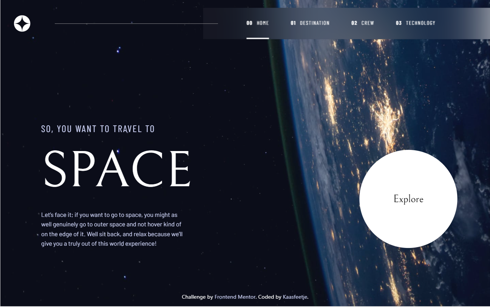
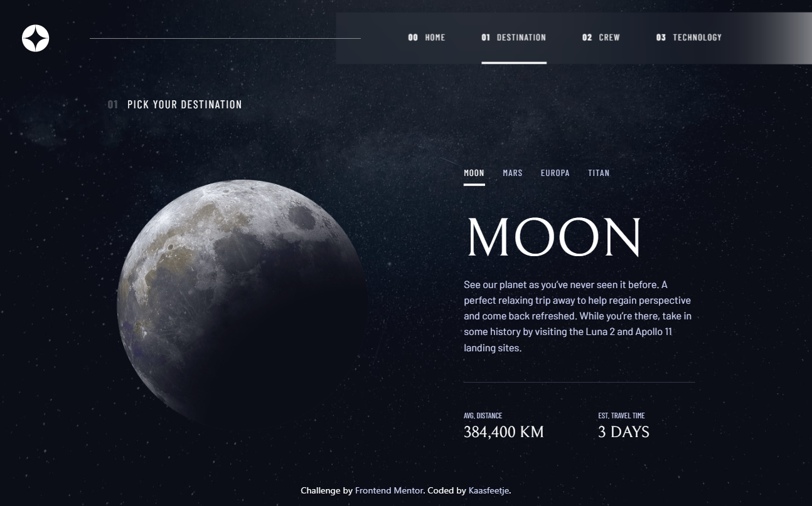
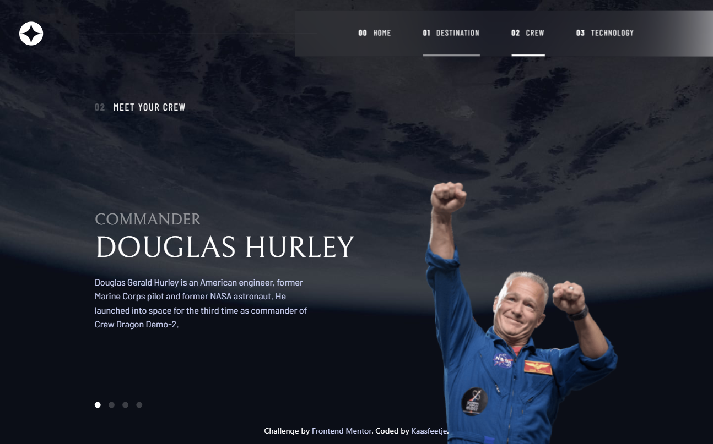
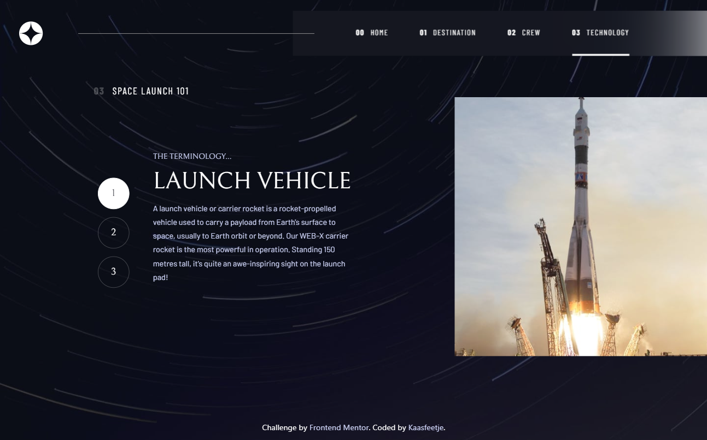

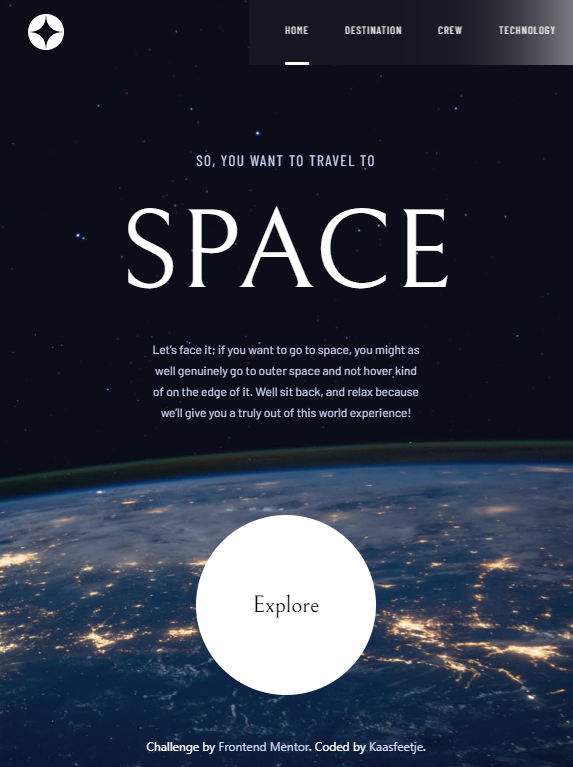
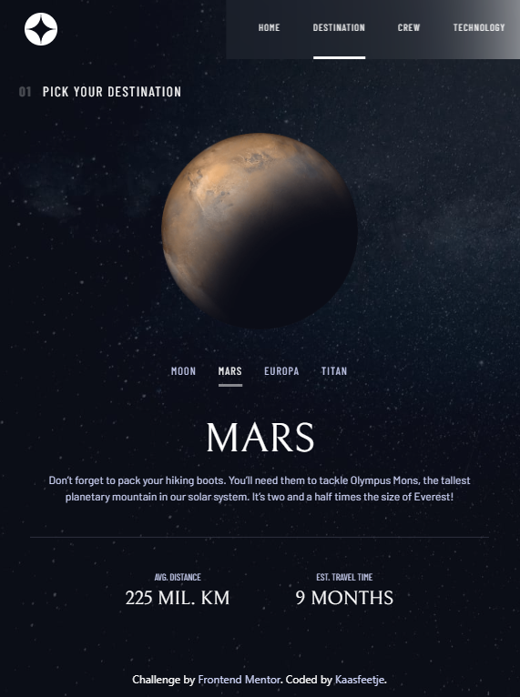
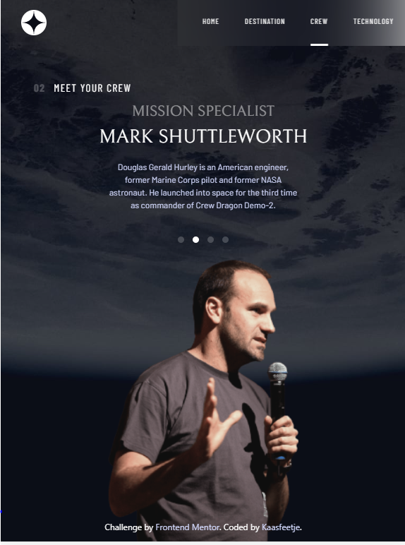
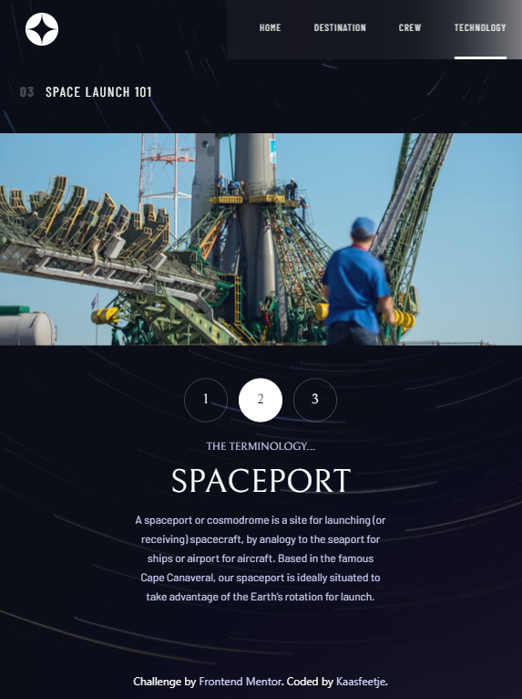

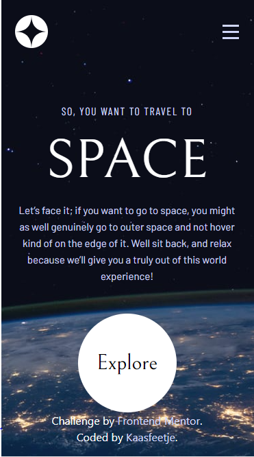
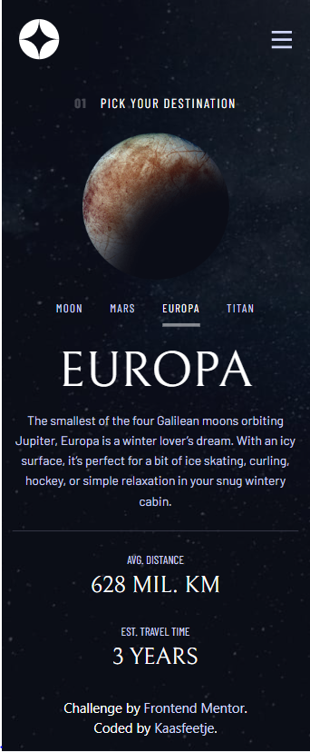
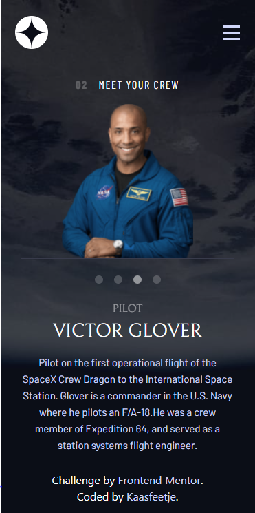
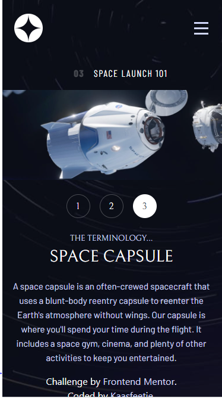
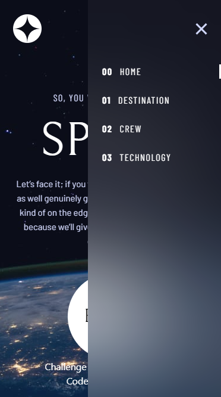

### Links

-   Solution URL: [Github](https://github.com/Kaasfeetje/Frontend-Mentor-Space-Tourism-Website)
-   Live Site URL: [Site](https://space-tourism-kaasfeetje.netlify.app/)

## My process

I started with removing the starter code, then immediately regretting it because it had the assets in it. So I took back the assets, but still removed the starter html.

I decided to handle this project on a component by component basis. I started with the header, because I always do. Starting your headers mobile first makes it so much easier. I've always struggled with the headers responsiveness, but that's definitely a thing I'm going to use going forward.

After this I started working page by page, since every page basically only had one distinct component. At this point I had not done any active states and such, I was gonna leave that to the end. I had some problems with the explore button on desktop size. It wouldn't position correctly, but in the end I managed to fix it.

I realized all 3 of the rest of the pages had a carousel, although I thought it wouldn't be worth the time to make a reusable carousel component, since it's not much more than an id that you can change on click, to switch between the items anyway.

The 3 other pages were quite straightforward, I didn't encounter manay problems. Sometimes I had to think about the css for a bit, but it wasn't that bad. Much of the code could be copied between the components(which is bad, since it means I should've extracted it), but I didn't mind it too much in a challenge project.

At the end I added the active states, most were quite simple. The home page explore button was a mess though, but I added a div around it so i could have the button and the effect seperated, so it would not overlap on hover.

### Built with

-   React
-   TailwindCSS
-   CSS Mediaqueries
-   React Router Dom

### What I learned

I learned turning a figma design into a website.

### Useful resources

-   [Active links](https://www.youtube.com/watch?v=UyHHmPvVEfI) - Helped me with active state in header
-   [Tailwind docs](https://tailwindcss.com/docs/font-size) - This helps so much with sizing

## Author

-   Github - [Kaasfeetje](https://github.com/Kaasfeetje)
-   Frontend Mentor - [@Kaasfeetje](https://www.frontendmentor.io/profile/Kaasfeetje)
-   Twitter - [@VeldhuisMax](https://www.twitter.com/VeldhuisMax)
